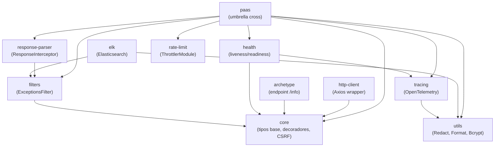

<div align="center">
    
    <h1>Tresdoce NestJS Toolkit</h1>
</div>

<div align="center">
    
    
    
    
    <a href="./license.md">
        
    </a>
    <br/>
    <a href="https://github.com/tresdoce/tresdoce-nestjs-toolkit/actions/workflows/master.yml" target="_blank">
        
    </a>
    <a href="https://app.codecov.io/gh/tresdoce/tresdoce-nestjs-toolkit/" target="_blank">
        
    </a>
    <a href="https://sonarcloud.io/summary/new_code?id=tresdoce_tresdoce-nestjs-toolkit" target="_blank">  
        
    </a>
    <a href="https://snyk.io/test/github/tresdoce/tresdoce-nestjs-toolkit" target="_blank">
        
    </a>
    <br/> 
</div>
<br>

Este toolkit está pensado para ser utilizado en [NestJS Starter](https://github.com/rudemex/nestjs-starter), o cualquier
proyecto que utilice una configuración centralizada, siguiendo la misma arquitectura del starter.

<br>
<div>
    <a href="https://www.buymeacoffee.com/rudemex" target="_blank"></a>
</div>

## Glosario

- [Demo](https://nestjs-starter.tresdoce.com.ar/v1/docs)
- [Requerimientos básicos](#basic-requirements)
- [Arquitectura y configuración centralizada](#architecture)
- [Interfaz AppConfig](#appconfig)
- [Grafo de dependencias entre paquetes](#dependency-graph)
- [Scripts](#scripts)
- [Toolkit](#toolkit)
- [Commits](#commits)
- [License MIT](license.md)

---

<a name="basic-requirements"></a>

## Requerimientos básicos

- [NestJS Starter](https://github.com/rudemex/nestjs-starter)
- Node.js v22.21.1 or higher ([Download](https://nodejs.org/es/download/))
- YARN >= 1.22.22 o NPM >= 11.6.4
- NestJS v11.1.11 or higher ([Documentación](https://nestjs.com/))
- Lerna

---

<a name="architecture"></a>

## Arquitectura y configuración centralizada

Todos los paquetes de este toolkit siguen un **patrón de configuración centralizada**: en lugar de que cada módulo reciba su configuración de forma independiente, todos leen desde un único `ConfigService` de NestJS bajo la clave `'config'`.

### Cómo funciona

1. La aplicación host registra una función de configuración usando `registerAs` de `@nestjs/config`:

```typescript
// configuration.ts
import { registerAs } from '@nestjs/config';
import { Typings } from '@tresdoce-nestjs-toolkit/core';

export default registerAs('config', (): Typings.AppConfig => ({
  project: { ... },
  server: { ... },
  swagger: { ... },
  redis: { ... },    // leído por @tresdoce-nestjs-toolkit/redis
  mailer: { ... },   // leído por @tresdoce-nestjs-toolkit/mailer
  // ...demás secciones opcionales
}));
```

2. Cada paquete de este toolkit inyecta `ConfigService` y accede **únicamente a su propia sección** del objeto `config`:

```typescript
// Ejemplo interno de RedisModule
@Injectable()
export class RedisService {
  constructor(private readonly configService: ConfigService) {}

  getOptions() {
    return this.configService.get<Typings.AppConfig>('config').redis;
  }
}
```

3. La interfaz `AppConfig` (exportada por `@tresdoce-nestjs-toolkit/core` bajo el namespace `Typings`) es el **contrato central** que garantiza la coherencia de tipos entre todos los paquetes.

### Ventajas del patrón

- **Un solo punto de verdad**: toda la configuración vive en `configuration.ts`.
- **Tipado end-to-end**: `AppConfig` valida en tiempo de compilación que cada sección tenga la forma correcta.
- **Modularidad real**: agregar o quitar un módulo equivale a agregar o quitar una clave del objeto de configuración.
- **Compatible con schematics**: los paquetes están diseñados para instalarse mediante `ng add` / schematics del [NestJS Starter](https://github.com/rudemex/nestjs-starter).

---

<a name="appconfig"></a>

## Interfaz AppConfig

La siguiente interfaz, definida en `packages/core/src/typings/index.ts` y exportada como `Typings.AppConfig`, es el contrato que une a todos los paquetes del toolkit.

```typescript
// @tresdoce-nestjs-toolkit/core — Typings.AppConfig
interface AppConfig {
  // REQUERIDO — metadatos de la aplicación (leídos del package.json del proyecto host)
  project: {
    apiPrefix: string;
    name: string;
    version: string;
    description: string;
    author: { name: string; email: string; url: string };
    repository: { type: string; url: string };
    bugs: { url: string };
    homepage: string;
    [key: string]: any;
  };

  // REQUERIDO — configuración de runtime del servidor
  server: {
    isProd: boolean;
    appStage: 'local' | 'test' | 'snd' | 'dev' | 'qa' | 'homo' | 'prod';
    port: number;
    context: string;
    origins: string[] | string;
    propagateHeaders?: string[]; // -> response-parser
    exposedHeaders?: string;
    allowedHeaders: string;
    allowedMethods: string;
    corsEnabled: boolean;
    corsCredentials: boolean;
    csrf?: CsrfCookieOptions; // -> @tresdoce-nestjs-toolkit/core
    rateLimits?: ThrottlerModuleOptions; // -> @tresdoce-nestjs-toolkit/rate-limit
  };

  // REQUERIDO — configuración de Swagger/OpenAPI
  swagger: {
    path: string;
    enabled: boolean;
  };

  // OPCIONAL — configuración de health checks
  // -> @tresdoce-nestjs-toolkit/health
  health?: {
    skipChecks?: ('storage' | 'memory' | 'elasticsearch' | 'camunda' | 'typeorm' | 'redis')[];
    storage?: DiskHealthIndicatorOptions;
    memory?: { heap: number; rss: number };
  };

  // OPCIONAL — servicios externos para health checks de conectividad HTTP
  // -> @tresdoce-nestjs-toolkit/health
  services?: Record<
    string,
    {
      url: string;
      timeout?: number;
      healthPath?: string;
      [key: string]: any;
    }
  >;

  // OPCIONAL — configuración del cliente HTTP (Axios + axios-retry)
  // -> @tresdoce-nestjs-toolkit/http-client
  httpClient?: {
    httpOptions?: HttpModuleOptions;
    propagateHeaders?: string[];
  };

  // OPCIONAL — configuración de base de datos relacional vía TypeORM
  // -> @tresdoce-nestjs-toolkit/typeorm
  database?: {
    typeorm?: TypeOrmModuleOptions;
  };

  // OPCIONAL — configuración de Redis para cache
  // -> @tresdoce-nestjs-toolkit/redis
  redis?: RedisOptions;

  // OPCIONAL — configuración del mailer (nodemailer)
  // -> @tresdoce-nestjs-toolkit/mailer
  mailer?: MailerOptions;

  // OPCIONAL — configuración de Camunda (BPMN)
  // -> @tresdoce-nestjs-toolkit/camunda
  camunda?: CamundaOptions;

  // OPCIONAL — configuración de Elasticsearch
  // -> @tresdoce-nestjs-toolkit/elk
  elasticsearch?: ElasticsearchOptions;

  // OPCIONAL — configuración de trazabilidad distribuida (OpenTelemetry)
  // -> @tresdoce-nestjs-toolkit/tracing
  tracing?: TracingOptions;

  // OPCIONAL — configuración de redacción de campos sensibles en logs
  // -> @tresdoce-nestjs-toolkit/utils (RedactModule)
  redact?: RedactOptions;

  // OPCIONAL — configuración de hashing con bcrypt
  // -> @tresdoce-nestjs-toolkit/utils (BcryptModule)
  bcrypt?: BcryptOptions;

  // OPCIONAL — configuración de generación de IDs únicos tipo Snowflake
  // -> @tresdoce-nestjs-toolkit/snowflake-uid
  snowflakeUID?: SnowFlakeOptions;

  // OPCIONAL — configuración de AWS Simple Queue Service
  // -> @tresdoce-nestjs-toolkit/aws-sqs
  sqs?: AwsSqsModuleOptions;

  // OPCIONAL — parámetros personalizados de la aplicación
  params?: Record<string, any>;

  [key: string]: any;
}
```

---

<a name="dependency-graph"></a>

## Grafo de dependencias entre paquetes

El siguiente diagrama muestra las dependencias internas entre los paquetes del toolkit (dependencias hacia paquetes externos de npm no se muestran).



**Paquetes standalone** (sin dependencias internas entre si): `aws-sqs`, `camunda`, `commons`, `dynamoose`, `mailer`, `qrcode`, `rate-limit`, `redis`, `snowflake-uid`, `typeorm`, `test-utils`.

---

<a name="scripts"></a>

## Scripts

Instalar Lerna

```
npm i -g lerna
```

Instalar dependencias del monorepo

```
yarn install
```

Crear paquetes

```
yarn plop
```

Transpilar paquetes

```
yarn build
```

Test paquetes

```
yarn test
```

---

<a name="toolkit"></a>

## Toolkit

Los módulos de la siguiente lista están pensados para ser consumidos por
el [NestJS Starter](https://github.com/rudemex/nestjs-starter), siguiendo los lineamientos de `schematics`.

> Es recomendable utilizar las versiones `estables`, ya que las versiones `beta` están pensadas para ser utilizadas a modo de testing y pueden generar conflictos en el código.

| Package                                                                  | Descripción                                               | Clave AppConfig                              | Versión                                                                                                                                                         | Changelog                                            |
| ------------------------------------------------------------------------ | --------------------------------------------------------- | -------------------------------------------- | --------------------------------------------------------------------------------------------------------------------------------------------------------------- | ---------------------------------------------------- |
| [`@tresdoce-nestjs-toolkit/archetype`](./packages/archetype)             | Módulo informativo de la app                              | `config.project.*`, `config.server.appStage` | [](https://www.npmjs.com/package/@tresdoce-nestjs-toolkit/archetype)             | [Changelog](./packages/archetype/CHANGELOG.md)       |
| [`@tresdoce-nestjs-toolkit/aws-sqs`](./packages/aws-sqs)                 | Módulo de cola de mensajes de AWS Simple Queue Service    | `config.sqs`                                 | [](https://www.npmjs.com/package/@tresdoce-nestjs-toolkit/aws-sqs)                 | [Changelog](./packages/aws-sqs/CHANGELOG.md)         |
| [`@tresdoce-nestjs-toolkit/camunda`](./packages/camunda)                 | Módulo de procesos BPMN con Camunda                       | `config.camunda`                             | [](https://www.npmjs.com/package/@tresdoce-nestjs-toolkit/camunda)                 | [Changelog](./packages/camunda/CHANGELOG.md)         |
| [`@tresdoce-nestjs-toolkit/commons`](./packages/commons)                 | Centralización de configuraciones de build y ESLint       | (configuración de herramientas, no de app)   | [](https://www.npmjs.com/package/@tresdoce-nestjs-toolkit/commons)                 | [Changelog](./packages/commons/CHANGELOG.md)         |
| [`@tresdoce-nestjs-toolkit/core`](./packages/core)                       | Tipos base (`AppConfig`), decoradores y helpers de CSRF   | (contrato central, no lee config)            | [](https://www.npmjs.com/package/@tresdoce-nestjs-toolkit/core)                       | [Changelog](./packages/core/CHANGELOG.md)            |
| [`@tresdoce-nestjs-toolkit/dynamoose`](./packages/dynamoose)             | Módulo de base de datos DynamoDB con Dynamoose            | (configuración propia, no usa AppConfig)     | [](https://www.npmjs.com/package/@tresdoce-nestjs-toolkit/dynamoose)             | [Changelog](packages/dynamoose/CHANGELOG.md)         |
| [`@tresdoce-nestjs-toolkit/elk`](./packages/elk)                         | Módulo de ElasticSearch Stack                             | `config.elasticsearch`                       | [](https://www.npmjs.com/package/@tresdoce-nestjs-toolkit/elk)                         | [Changelog](./packages/elk/CHANGELOG.md)             |
| [`@tresdoce-nestjs-toolkit/filters`](./packages/filters)                 | Filtro global de excepciones HTTP                         | (inyectado directamente, sin clave config)   | [](https://www.npmjs.com/package/@tresdoce-nestjs-toolkit/filters)                 | [Changelog](./packages/filters/CHANGELOG.md)         |
| [`@tresdoce-nestjs-toolkit/health`](./packages/health)                   | Health checks de liveness y readiness                     | `config.health`, `config.services`           | [](https://www.npmjs.com/package/@tresdoce-nestjs-toolkit/health)                   | [Changelog](./packages/health/CHANGELOG.md)          |
| [`@tresdoce-nestjs-toolkit/http-client`](./packages/http-client)         | Cliente HTTP con Axios y axios-retry                      | `config.httpClient`                          | [](https://www.npmjs.com/package/@tresdoce-nestjs-toolkit/http-client)         | [Changelog](./packages/http-client/CHANGELOG.md)     |
| [`@tresdoce-nestjs-toolkit/mailer`](./packages/mailer)                   | Módulo para envíos de mail                                | `config.mailer`                              | [](https://www.npmjs.com/package/@tresdoce-nestjs-toolkit/mailer)                   | [Changelog](./packages/mailer/CHANGELOG.md)          |
| [`@tresdoce-nestjs-toolkit/paas`](./packages/paas)                       | Librería centralizada de funcionalidades cross (umbrella) | múltiples (ver paquetes que agrupa)          | [](https://www.npmjs.com/package/@tresdoce-nestjs-toolkit/paas)                       | [Changelog](./packages/paas/CHANGELOG.md)            |
| [`@tresdoce-nestjs-toolkit/qrcode`](./packages/qrcode)                   | Módulo para crear códigos QR                              | (configuración propia, no usa AppConfig)     | [](https://www.npmjs.com/package/@tresdoce-nestjs-toolkit/qrcode)                   | [Changelog](./packages/qrcode/CHANGELOG.md)          |
| [`@tresdoce-nestjs-toolkit/rate-limit`](./packages/rate-limit)           | Limitador de requests por segundo en controllers          | `config.server.rateLimits`                   | [](https://www.npmjs.com/package/@tresdoce-nestjs-toolkit/rate-limit)           | [Changelog](./packages/rate-limit/CHANGELOG.md)      |
| [`@tresdoce-nestjs-toolkit/redis`](./packages/redis)                     | Módulo de Redis para cache                                | `config.redis`                               | [](https://www.npmjs.com/package/@tresdoce-nestjs-toolkit/redis)                     | [Changelog](./packages/redis/CHANGELOG.md)           |
| [`@tresdoce-nestjs-toolkit/response-parser`](./packages/response-parser) | Interceptor de formateo de respuesta                      | `config.server.propagateHeaders`             | [](https://www.npmjs.com/package/@tresdoce-nestjs-toolkit/response-parser) | [Changelog](./packages/response-parser/CHANGELOG.md) |
| [`@tresdoce-nestjs-toolkit/snowflake-uid`](./packages/snowflake-uid)     | Módulo de generación de IDs únicos tipo Snowflake         | `config.snowflakeUID`                        | [](https://www.npmjs.com/package/@tresdoce-nestjs-toolkit/snowflake-uid)     | [Changelog](./packages/snowflake-uid/CHANGELOG.md)   |
| [`@tresdoce-nestjs-toolkit/test-utils`](./packages/test-utils)           | Utilities para testing                                    | (utilidades de test, no usa AppConfig)       | [](https://www.npmjs.com/package/@tresdoce-nestjs-toolkit/test-utils)           | [Changelog](./packages/test-utils/CHANGELOG.md)      |
| [`@tresdoce-nestjs-toolkit/tracing`](./packages/tracing)                 | Módulo de trazabilidad distribuida con OpenTelemetry      | `config.tracing`                             | [](https://www.npmjs.com/package/@tresdoce-nestjs-toolkit/tracing)                 | [Changelog](./packages/tracing/CHANGELOG.md)         |
| [`@tresdoce-nestjs-toolkit/typeorm`](./packages/typeorm)                 | Módulo de ORM para base de datos relacional               | `config.database.typeorm`                    | [](https://www.npmjs.com/package/@tresdoce-nestjs-toolkit/typeorm)                 | [Changelog](./packages/typeorm/CHANGELOG.md)         |
| [`@tresdoce-nestjs-toolkit/utils`](./packages/utils)                     | Utilitarios para proyectos y librerías                    | `config.redact`, `config.bcrypt`             | [](https://www.npmjs.com/package/@tresdoce-nestjs-toolkit/utils)                     | [Changelog](./packages/utils/CHANGELOG.md)           |

<!---PLOP-TOOLKIT-TABLE-->

---

<a name="commits"></a>

## Commits

Para los mensajes de commits se toma como
referencia [`conventional commits`](https://www.conventionalcommits.org/es/v1.0.0/#resumen).

```
<type>[optional scope]: <description>

[optional body]

[optional footer]
```

- **type:** chore, docs, feat, fix, refactor, test (más comunes)
- **scope:** indica la página, componente, funcionalidad
- **description:** comienza en minúsculas y no debe superar los 72 caracteres.

### Ejemplo Commit

```
git commit -m "docs(core): add documentantion to readme core module"
```

### Commit Breaking Change

```
git commit -am 'feat!: changes in application'
```

---

<div align="center">
    <a href="mailto:mdelgado@tresdoce.com.ar" target="_blank" alt="Send an email">
        
    </a><br/>
    <p>Made with ❤️</p>
</div>
