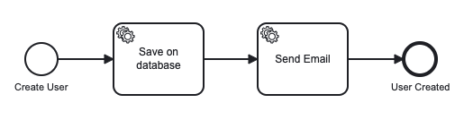

<div align="center">
    
    <h1>Tresdoce NestJS Toolkit<br/>Camunda</h1>
</div>

<div align="center">
    
    
    <br/>
    
    
    <br/>
</div>
<br/>

Este módulo está pensado para ser utilizado en [NestJS Starter](https://github.com/rudemex/nestjs-starter), o cualquier
proyecto que utilice una configuración centralizada, siguiendo la misma arquitectura del starter.

## Glosario

- [🥳 Demo](https://nestjs-starter.tresdoce.com.ar/v1/docs)
- [📝 Requerimientos básicos](#basic-requirements)
- [🛠️ Instalar dependencia](#install-dependencies)
- [⚙️ Configuración](#configurations)
- [👨‍💻 Uso](#use)
- [🤓 Ejemplo](#example)
- [📄 Changelog](./CHANGELOG.md)
- [📜 License MIT](./license.md)

---

<a name="basic-requirements"></a>

## 📝 Requerimientos básicos

- [NestJS Starter](https://github.com/rudemex/nestjs-starter)
- Node.js v22.21.1 or higher ([Download](https://nodejs.org/es/download/))
- YARN ≥ 1.22.22 o NPM ≥ 11.6.4
- NestJS v11.1.10 or higher ([Documentación](https://nestjs.com/))

<a name="install-dependencies"></a>

## 🛠️ Instalar dependencia

```
npm install -S @tresdoce-nestjs-toolkit/camunda
```

```
yarn add @tresdoce-nestjs-toolkit/camunda
```

<a name="configurations"></a>

## ⚙️ Configuración

Agregar los datos de conexión a Camunda en `configuration.ts` utilizando el key `camunda` y que contenga el
objeto con los datos conexión desde las variables de entorno.

```typescript
//./src/config/configuration.ts
import { Typings } from '@tresdoce-nestjs-toolkit/core';
import { registerAs } from '@nestjs/config';
//import { logger } from '@tresdoce-nestjs-toolkit/camunda';

export default registerAs('config', (): Typings.AppConfig => {
  return {
    //...
    camunda: {
      baseUrl: process.env.CAMUNDA_URL_REST || 'http://localhost:8443/engine-rest',
      //use: logger,
    },
    //...
  };
});
```

<details>
<summary>💬 Para ver en detalle todas las propiedades de la configuración, hace clic acá.</summary>

`baseUrl`: Ruta de acceso a la API de Camunda.

- Type: `String`
- Required: `true`

`workerId`: Es el ID del worker en el que se obtienen las tareas, las tareas devueltas están bloqueadas para ese worker
y solo pueden completarse si se proporciona el mismo workerId.

- Type: `String`
- Required: `false`
- Default: `some-random-id`

`maxTasks`: Es el número máximo de tareas a recuperar.

- Type: `Number`
- Required: `false`
- Default: `10`

`maxParallelExecutions`: Es el número máximo de tareas en las que se puede trabajar simultáneamente.

- Type: `Number`
- Required: `false`

`interval`: Es el intervalo de tiempo para esperar antes de hacer un nuevo sondeo.

- Type: `Number`
- Required: `false`
- Default: `300`

`lockDuration`: Es la duración por defecto para bloquear las tareas externas en milisegundos.

- Type: `Number`
- Required: `false`
- Default: `50000`

`autoPoll`: Si es verdadero, el sondeo se inicia automáticamente en cuanto se crea una instancia de Cliente.

- Type: `Boolean`
- Required: `false`
- Default: `true`

`asyncResponseTimeout`: Ee el tiempo de espera del sondeo largo en milisegundos.

- Type: `Number`
- Required: `false`

`usePriority`: Si es falso, la tarea será obtenida arbitrariamente en lugar de basarse en su prioridad.

- Type: `Boolean`
- Required: `false`
- Default: `true`

`interceptors`: Función(es) que será(n) llamada(s) antes de que se envíe una solicitud. Los interceptores reciben la
configuración de la solicitud y devuelven una nueva configuración.

- Type: `Funtion | [Function]`
- Required: `false`

`use`: Función(es) que tiene(n) acceso a la instancia del cliente tan pronto como se crea y antes de que ocurra
cualquier sondeo. Consulta
el [logger](https://github.com/camunda/camunda-external-task-client-js/blob/master/docs/logger.md) para entender mejor
el uso de los middlewares.

- Type: `Funtion | [Function]`
- Required: `false`

Para más información sobre los parámetros de conexión, puedes consultar en
la [Documentación](https://github.com/camunda/camunda-external-task-client-js/blob/master/docs/Client.md#new-clientoptions)
de Camunda.

</details>

<a name="use"></a>

## 👨‍💻 Uso

Primero hay que instanciar el `CamundaTaskConnector` como **microservice** en la inicialización de nuestra aplicación.

```typescript
//./src/main.ts
//...
import { CamundaTaskConnector } from '@tresdoce-nestjs-toolkit/camunda';

async function bootstrap() {
  //...
  app.connectMicroservice({
    strategy: app.get(CamundaTaskConnector),
  });
  await app.startAllMicroservices();
  //..
}
```

Luego hay que instanciar el módulo de camunda.

```typescript
//./src/app.module.ts
//...
import { CamundaModule } from '@tresdoce-nestjs-toolkit/camunda';

@Module({
  imports: [
    //...
    CamundaModule,
    //...
  ],
  //...
})
export class AppModule {}
```

<a name="example"></a>

## 🤓 Ejemplo

> ⚠️ Entiéndase que el siguiente ejemplo es a modo ilustrativo de como utilizar este
> módulo junto con Camunda, y no tiene todo el scope completo, como la integración a una BD, el envío del mail o los DTO
> para el request de creación.

Para este ejemplo, vamos a trabajar un proceso BPMN sencillo para la creación de un usuario, la cual tiene unos procesos
para realizar del lado del código.

Puedes descargarte este proceso BPMN
haciendo [clic acá](https://raw.githubusercontent.com/tresdoce/tresdoce-nestjs-toolkit/master/packages/camunda/.readme-static/create-user.bpmn)
o [acá](./.readme-static/create-user.bpmn).

<div align="center">
    
</div>

### Docker de Camunda

```sh
docker run -d --name camunda -p 8443:8080 camunda/camunda-bpm-platform:run-latest

# open browser with url: http://localhost:8443/camunda-welcome/index.html
# Tasklist: http://localhost:8443/camunda/app/welcome/default/#!/login
# user: demo
# pass: demo
# API Rest: http://localhost:8443/swaggerui/
```

```typescript
//...
import { Ctx, Payload } from '@nestjs/microservices';
import { HttpClientService } from '@tresdoce-nestjs-toolkit/http-client';
import {
  Subscription,
  HandleFailureOptions,
  Task,
  TaskService,
  Variables,
  logger,
} from '@tresdoce-nestjs-toolkit/camunda';

@Controller()
export class MyController {
  constructor(private readonly httpClient: HttpClientService) {}

  // ========================
  // Lanzar instancia por API
  // ========================
  @Get('create-user')
  async createUser() {
    try {
      // Seteamos las variables para lanzar el proceso BPMN
      const dataInstance = {
        variables: {
          username: { value: 'juan' },
          email: { value: 'juan@email.com' },
        },
      };

      // Hacemos un post a la API de Camunda para iniciar el proceso de BPMN
      const { data } = await this.httpClient.post(
        encodeURI(`http://localhost:8443/engine-rest/process-definition/key/create-user/start`),
        {
          data: dataInstance,
        },
      );

      return data;
    } catch (error) {
      throw new HttpException(error.message, error.response.status);
    }
  }

  // ==================================================
  // Subscripcion al evento de guardar en base de datos
  // ==================================================
  @Subscription('save-database')
  async saveDatabase(@Payload() task: Task, @Ctx() taskService: TaskService) {
    try {
      const username = task.variables.get('username');
      const email = task.variables.get('email');

      console.log(`Username: ${username}`);
      console.log(`Email: ${email}`);

      /*
       * Aca estaría el código para guardar en la BD
       */

      await taskService.complete(task);
      logger.log(`completed task ${task.id}`, 'Camunda');
    } catch (error) {
      const options: HandleFailureOptions = {
        errorMessage: error.message,
      };
      await taskService.handleFailure(task, options);
      logger.error(error);
    }
  }

  // ============================================
  // Subscripcion para el evento de envio de mail
  // ============================================
  @Subscription('send-email')
  async sendEmail(@Payload() task: Task, @Ctx() taskService: TaskService) {
    try {
      const username = task.variables.get('username');
      const email = task.variables.get('email');

      console.log(`Username: ${username}`);
      console.log(`Email: ${email}`);

      /*
       * Aca estaría el código para enviar un mail
       */

      await taskService.complete(task);
      logger.log(`completed task ${task.id}`, 'Camunda');
    } catch (error) {
      const options: HandleFailureOptions = {
        errorMessage: error.message,
      };
      await taskService.handleFailure(task, options);
      logger.error(error);
    }
  }
}
```

## 📄 Changelog

Todos los cambios notables de este paquete se documentarán en el archivo [Changelog](./CHANGELOG.md).

---

<div align="center">
    <a href="mailto:mdelgado@tresdoce.com.ar" target="_blank" alt="Send an email">
        
    </a><br/>
    <p>Made with ❤</p>
</div>
