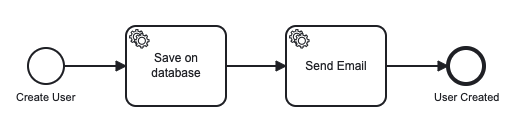

<div align="center">
    
    <h1>Tresdoce NestJS Toolkit<br/>Camunda</h1>
</div>

<div align="center">
    
    
    <br/>
    
    
    <br/>
</div>
<br/>

Este módulo está pensado para ser utilizado en [NestJS Starter](https://github.com/rudemex/nestjs-starter), o cualquier
proyecto que utilice una configuración centralizada, siguiendo la misma arquitectura del starter.

## Glosario

- [📝 Requerimientos básicos](#basic-requirements)
- [🛠️ Instalar dependencia](#install-dependencies)
- [⚙️ Configuración](#configurations)
- [👨‍💻 Uso](#use)
- [🤓 Ejemplo](#example)
- [📖 API Reference](#api-reference)
- [📄 Changelog](./CHANGELOG.md)
- [📜 License MIT](./license.md)

---

<a name="basic-requirements"></a>

## 📝 Requerimientos básicos

- [NestJS Starter](https://github.com/rudemex/nestjs-starter)
- Node.js v22.21.1 or higher ([Download](https://nodejs.org/es/download/))
- YARN ≥ 1.22.22 o NPM ≥ 11.6.4
- NestJS v11.1.11 or higher ([Documentación](https://nestjs.com/))

<a name="install-dependencies"></a>

## 🛠️ Instalar dependencia

```
npm install -S @tresdoce-nestjs-toolkit/camunda
```

```
yarn add @tresdoce-nestjs-toolkit/camunda
```

## 📦 Dependencias internas

Este paquete no tiene dependencias internas del toolkit. Puede utilizarse de forma independiente.

<a name="configurations"></a>

## ⚙️ Configuración

Agregar los datos de conexión a Camunda en `configuration.ts` utilizando el key `camunda`, con los datos de conexión
desde las variables de entorno.

```typescript
//./src/config/configuration.ts
import { Typings } from '@tresdoce-nestjs-toolkit/core';
import { registerAs } from '@nestjs/config';
// import { logger } from '@tresdoce-nestjs-toolkit/camunda';

export default registerAs('config', (): Typings.AppConfig => {
  return {
    //...
    camunda: {
      baseUrl: process.env.CAMUNDA_URL_REST || 'http://localhost:8443/engine-rest',
      // use: logger,
    },
    //...
  };
});
```

<details>
<summary>💬 Para ver en detalle todas las propiedades de la configuración, hace clic acá.</summary>

`baseUrl`: Ruta de acceso a la API REST de Camunda.

- Type: `String`
- Required: `true`

`workerId`: Es el ID del worker. Las tareas devueltas quedan bloqueadas para ese worker y solo pueden completarse si se
proporciona el mismo `workerId`.

- Type: `String`
- Required: `false`
- Default: `some-random-id`

`maxTasks`: Número máximo de tareas a recuperar por ciclo de polling.

- Type: `Number`
- Required: `false`
- Default: `10`

`maxParallelExecutions`: Número máximo de tareas en las que se puede trabajar simultáneamente.

- Type: `Number`
- Required: `false`

`interval`: Intervalo de tiempo en milisegundos entre ciclos de polling.

- Type: `Number`
- Required: `false`
- Default: `300`

`lockDuration`: Duración por defecto para bloquear las tareas externas en milisegundos.

- Type: `Number`
- Required: `false`
- Default: `50000`

`autoPoll`: Si es `true`, el polling se inicia automáticamente al crear una instancia del cliente.

- Type: `Boolean`
- Required: `false`
- Default: `true`

`asyncResponseTimeout`: Tiempo de espera del long polling en milisegundos.

- Type: `Number`
- Required: `false`

`usePriority`: Si es `false`, las tareas se obtendrán arbitrariamente en lugar de basarse en su prioridad.

- Type: `Boolean`
- Required: `false`
- Default: `true`

`interceptors`: Función o array de funciones llamadas antes de enviar cada solicitud. Reciben la configuración de la
solicitud y devuelven una nueva configuración.

- Type: `Function | Function[]`
- Required: `false`

`use`: Función o array de funciones que tienen acceso a la instancia del cliente tan pronto como se crea y antes de
que ocurra cualquier polling. Es el punto de extensión para middlewares como el logger incluido en el paquete.

- Type: `Function | Function[]`
- Required: `false`

Para más información sobre los parámetros de conexión, consultar la
[documentación de Camunda](https://github.com/camunda/camunda-external-task-client-js/blob/master/docs/Client.md#new-clientoptions).

</details>

<a name="use"></a>

## 👨‍💻 Uso

### 1. Importar el módulo

El `CamundaModule` está marcado como `@Global()`, por lo que basta con importarlo una sola vez en `AppModule`. Sus
providers quedan disponibles en toda la aplicación sin necesidad de importar el módulo nuevamente en cada feature module.

```typescript
//./src/app.module.ts
import { CamundaModule } from '@tresdoce-nestjs-toolkit/camunda';

@Module({
  imports: [
    //...
    CamundaModule,
    //...
  ],
})
export class AppModule {}
```

### 2. Conectar el microservicio en `main.ts`

El `CamundaTaskConnector` implementa `CustomTransportStrategy` de NestJS. Debe conectarse como microservicio en el
arranque de la aplicación para que el cliente de Camunda empiece a hacer polling de tareas externas.

```typescript
//./src/main.ts
import { CamundaTaskConnector } from '@tresdoce-nestjs-toolkit/camunda';

async function bootstrap() {
  const app = await NestFactory.create(AppModule);

  app.connectMicroservice({
    strategy: app.get(CamundaTaskConnector),
  });
  await app.startAllMicroservices();

  await app.listen(3000);
}
bootstrap();
```

### 3. Suscribirse a tópicos con `@Subscription`

El decorador `@Subscription(topic, options?)` registra un método como handler de un tópico de Camunda. Internamente
usa `@MessagePattern` de NestJS microservices para asociar el método al tópico indicado.

El método recibe el `task` (via `@Payload()`) y el `taskService` (via `@Ctx()`), que permiten completar o fallar la
tarea.

```typescript
import { Controller, Get } from '@nestjs/common';
import { Payload, Ctx } from '@nestjs/microservices';
import {
  Subscription,
  Task,
  TaskService,
  HandleFailureOptions,
  logger,
} from '@tresdoce-nestjs-toolkit/camunda';

@Controller()
export class ProcessController {
  @Subscription('save-database')
  async saveDatabase(@Payload() task: Task, @Ctx() taskService: TaskService): Promise<void> {
    try {
      const username = task.variables.get('username');
      const email = task.variables.get('email');

      // Lógica de negocio...

      await taskService.complete(task);
      logger.log(`Task ${task.id} completed`, 'Camunda');
    } catch (error) {
      const options: HandleFailureOptions = { errorMessage: error.message };
      await taskService.handleFailure(task, options);
      logger.error(error);
    }
  }
}
```

#### `@Subscription` con opciones

El segundo parámetro de `@Subscription` acepta un objeto `SubscribeOptions` que permite configurar comportamientos
como la duración del bloqueo de la tarea. Las opciones se pasan directamente al método `client.subscribe` del SDK de
Camunda.

```typescript
import {
  Subscription,
  Task,
  TaskService,
  SubscribeOptions,
} from '@tresdoce-nestjs-toolkit/camunda';

@Controller()
export class ProcessController {
  @Subscription('send-email', { lockDuration: 10000 })
  async sendEmail(@Payload() task: Task, @Ctx() taskService: TaskService): Promise<void> {
    // El bloqueo de esta tarea durará 10 segundos
    await taskService.complete(task);
  }
}
```

<a name="example"></a>

## 🤓 Ejemplo

> Nota: El siguiente ejemplo ilustra el uso del módulo junto con Camunda. No incluye el scope completo (integración a
> BD, envío de mail, DTOs de request, etc.).

Para este ejemplo se trabaja un proceso BPMN sencillo para la creación de un usuario.

Puedes descargar el proceso BPMN
haciendo [clic acá](https://raw.githubusercontent.com/tresdoce/tresdoce-nestjs-toolkit/master/packages/camunda/.readme-static/create-user.bpmn)
o [acá](./.readme-static/create-user.bpmn).

<div align="center">
    
</div>

### Docker de Camunda

```sh
docker run -d --name camunda -p 8443:8080 camunda/camunda-bpm-platform:run-latest

# Abrir en el browser: http://localhost:8443/camunda-welcome/index.html
# Tasklist: http://localhost:8443/camunda/app/welcome/default/#!/login
# user: demo / pass: demo
# API Rest: http://localhost:8443/swaggerui/
```

### Ejemplo completo del controller

```typescript
import { Controller, Get, HttpException } from '@nestjs/common';
import { Payload, Ctx } from '@nestjs/microservices';
import { HttpClientService } from '@tresdoce-nestjs-toolkit/http-client';
import {
  Subscription,
  HandleFailureOptions,
  Task,
  TaskService,
  logger,
} from '@tresdoce-nestjs-toolkit/camunda';

@Controller()
export class MyController {
  constructor(private readonly httpClient: HttpClientService) {}

  // Lanzar instancia por API
  @Get('create-user')
  async createUser() {
    try {
      const dataInstance = {
        variables: {
          username: { value: 'juan' },
          email: { value: 'juan@email.com' },
        },
      };

      const { data } = await this.httpClient.post(
        encodeURI(`http://localhost:8443/engine-rest/process-definition/key/create-user/start`),
        { data: dataInstance },
      );

      return data;
    } catch (error) {
      throw new HttpException(error.message, error.response.status);
    }
  }

  // Suscripción al evento de guardar en base de datos
  @Subscription('save-database')
  async saveDatabase(@Payload() task: Task, @Ctx() taskService: TaskService) {
    try {
      const username = task.variables.get('username');
      const email = task.variables.get('email');

      console.log(`Username: ${username}`);
      console.log(`Email: ${email}`);

      // Código para guardar en la BD...

      await taskService.complete(task);
      logger.log(`completed task ${task.id}`, 'Camunda');
    } catch (error) {
      const options: HandleFailureOptions = { errorMessage: error.message };
      await taskService.handleFailure(task, options);
      logger.error(error);
    }
  }

  // Suscripción para el evento de envío de mail
  @Subscription('send-email')
  async sendEmail(@Payload() task: Task, @Ctx() taskService: TaskService) {
    try {
      const username = task.variables.get('username');
      const email = task.variables.get('email');

      console.log(`Username: ${username}`);
      console.log(`Email: ${email}`);

      // Código para enviar un mail...

      await taskService.complete(task);
      logger.log(`completed task ${task.id}`, 'Camunda');
    } catch (error) {
      const options: HandleFailureOptions = { errorMessage: error.message };
      await taskService.handleFailure(task, options);
      logger.error(error);
    }
  }
}
```

<a name="api-reference"></a>

## 📖 API Reference

### `CamundaModule`

Módulo global (`@Global()`) que registra el `CamundaTaskConnector` y su configuración. Basta con importarlo una sola
vez en `AppModule`.

---

### `CamundaTaskConnector`

Servicio que implementa `CustomTransportStrategy` y actúa como puente entre NestJS y el cliente de Camunda External
Task.

#### `listen(callback: () => void): Promise<void>`

Inicia el cliente de Camunda y suscribe los handlers registrados. Llamado internamente por NestJS al iniciar los
microservicios.

#### `close(): void`

Detiene el cliente de Camunda. Llamado por NestJS cuando la aplicación se cierra.

#### `unwrap<T>(): T`

Devuelve la instancia interna del cliente de Camunda (`Client` del SDK). Útil cuando se necesita acceder directamente
a la API del cliente.

```typescript
import { Client } from '@tresdoce-nestjs-toolkit/camunda';

const client = camundaTaskConnector.unwrap<Client>();
```

---

### `@Subscription(topic: string, options?: SubscribeOptions)`

Decorador de método que registra un handler para el tópico indicado de Camunda.

| Parámetro | Tipo               | Requerido | Descripción                                      |
| --------- | ------------------ | :-------: | ------------------------------------------------ |
| `topic`   | `string`           |    Si     | Nombre del tópico de la tarea externa en Camunda |
| `options` | `SubscribeOptions` |    No     | Opciones de suscripción (ej. `lockDuration`)     |

---

### `BasicAuthInterceptor` y `BasicAuthInterceptorConfig`

Interceptor re-exportado desde `camunda-external-task-client-js` que agrega autenticación HTTP Basic a cada solicitud
al servidor de Camunda. Puede usarse en la propiedad `interceptors` de la configuración.

```typescript
import { BasicAuthInterceptor, BasicAuthInterceptorConfig } from '@tresdoce-nestjs-toolkit/camunda';

const config: BasicAuthInterceptorConfig = {
  username: 'demo',
  password: 'demo',
};

// En configuration.ts:
camunda: {
  baseUrl: 'http://localhost:8443/engine-rest',
  interceptors: new BasicAuthInterceptor(config),
}
```

---

### `logger`

Middleware de logging re-exportado desde `camunda-external-task-client-js`. Puede usarse en la propiedad `use` de la
configuración del cliente para registrar eventos del ciclo de vida de las tareas.

```typescript
import { logger } from '@tresdoce-nestjs-toolkit/camunda';

// En configuration.ts:
camunda: {
  baseUrl: 'http://localhost:8443/engine-rest',
  use: logger,
}
```

También está disponible como función de logging directa en el código de los handlers:

```typescript
logger.log('mensaje informativo', 'Contexto');
logger.error('mensaje de error');
```

---

### Tipos y interfaces exportadas

| Nombre                       | Origen                            | Descripción                                           |
| ---------------------------- | --------------------------------- | ----------------------------------------------------- |
| `CamundaOptions`             | `camunda.interface.ts`            | Alias de `ClientConfig`. Tipo de opciones del módulo. |
| `Client`                     | `camunda-external-task-client-js` | Clase cliente del SDK de Camunda.                     |
| `ClientConfig`               | `camunda-external-task-client-js` | Configuración del cliente de Camunda.                 |
| `Variables`                  | `camunda-external-task-client-js` | Clase para manipular variables de una tarea.          |
| `Task`                       | `camunda-external-task-client-js` | Tipo de la tarea externa recibida en el handler.      |
| `TaskService`                | `camunda-external-task-client-js` | Servicio para completar o fallar una tarea.           |
| `HandleFailureOptions`       | `camunda-external-task-client-js` | Opciones para reportar un fallo en una tarea.         |
| `SubscribeOptions`           | `camunda-external-task-client-js` | Opciones de suscripción a un tópico.                  |
| `TopicSubscription`          | `camunda-external-task-client-js` | Tipo que representa una suscripción a un tópico.      |
| `TypedValue`                 | `camunda-external-task-client-js` | Valor tipado de una variable de Camunda.              |
| `HandlerArgs`                | `camunda-external-task-client-js` | Argumentos del handler (`{ task, taskService }`).     |
| `Logger`                     | `camunda-external-task-client-js` | Clase de logging del SDK.                             |
| `BasicAuthInterceptor`       | `camunda-external-task-client-js` | Interceptor de autenticación HTTP Basic.              |
| `BasicAuthInterceptorConfig` | `camunda-external-task-client-js` | Configuración del interceptor de autenticación.       |

## 📄 Changelog

Todos los cambios notables de este paquete se documentarán en el archivo [Changelog](./CHANGELOG.md).

---

<div align="center">
    <a href="mailto:mdelgado@tresdoce.com.ar" target="_blank" alt="Send an email">
        
    </a><br/>
    <p>Made with ❤</p>
</div>
