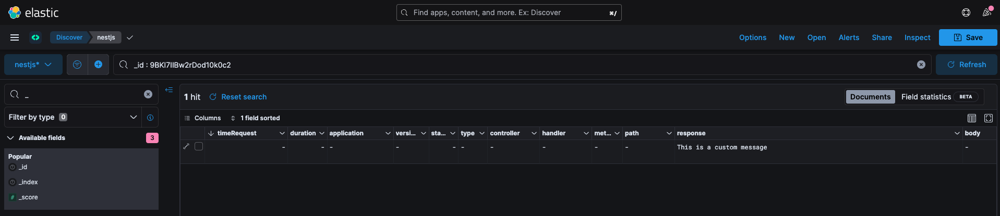

<div align="center">
    
    <h1>Tresdoce NestJs Toolkit<br/>Elk</h1>
</div>

<div align="center">
    
    
    <br/>
    
    
    <br/>
</div>
<br/>

Este módulo está pensado para ser utilizado en [NestJs Starter](https://github.com/rudemex/nestjs-starter), o cualquier
proyecto que utilice una configuración centralizada, siguiendo la misma arquitectura del starter.

## Glosario

- [🥳 Demo](https://rudemex-nestjs-starter.herokuapp.com/docs)
- [📝 Requerimientos básicos](#basic-requirements)
- [🛠️ Instalar dependencia](#install-dependencies)
- [⚙️ Configuración](#configurations)
- [👨‍💻 Uso](#use)
- [📄 Changelog](./CHANGELOG.md)
- [📜 License MIT](./license.md)

---

<a name="basic-requirements"></a>

## 📝 Requerimientos básicos

- [NestJs Starter](https://github.com/rudemex/nestjs-starter)
- Node.js v14.17.0 or higher ([Download](https://nodejs.org/es/download/))
- YARN v1.22.17 or higher
- NPM v6.14.13 or higher
- NestJS v8.2.6 or higher ([Documentación](https://nestjs.com/))

<a name="install-dependencies"></a>

## 🛠️ Instalar dependencia

```
npm install -S @tresdoce-nestjs-toolkit/elk
```

```
yarn add @tresdoce-nestjs-toolkit/elk
```

<a name="configurations"></a>

## ⚙️ Configuración

Agregar los datos de conexión a Elasticsearch en `configuration.ts` utilizando el key `elasticsearch` y que contenga el
objeto con los datos conexión desde las variables de entorno.

El objeto toma como argumentos los datos de configuración
de [@elastic/elasticsearch](https://www.npmjs.com/package/@elastic/elasticsearch), podés encontrar más información en
la [documentación](https://www.elastic.co/guide/en/elasticsearch/client/javascript-api/current/client-configuration.html)

```typescript
//./src/config/configuration.ts
import { Typings } from '@tresdoce-nestjs-toolkit/core';
import { registerAs } from '@nestjs/config';

export default registerAs('config', (): Typings.AppConfig => {
  return {
    //...
    elasticsearch: {
      name: PACKAGE_JSON.name,
      node: process.env.ELASTICSEARCH_NODE, // Default: 'http://localhost:9200',
    },
    //...
  };
});
```

Configurar el `ElkInterceptor` en el archivo `main.ts` para que pueda interceptar los **requests** y **responses** y los
envíe automáticamente al elasticsearch.

```typescript
//./src/main.ts
//...
import { ElkInterceptor, ElkService } from '@tresdoce-nestjs-toolkit/elk';

async function bootstrap() {
  //...
  app.useGlobalInterceptors(new ElkInterceptor(app.get<ElkService>(ElkService)));
  //...
}
```

Instanciar el módulo `ElkModule` en el archivo `app.module.ts`.

```typescript
//./src/app.module.ts
//...
import { ElkModule } from '@tresdoce-nestjs-toolkit/elk';

@Module({
  imports: [
    //...
    ElkModule,
    //...
  ],
  //...
})
export class AppModule {}
```

<a name="use"></a>

## 👨‍💻 Uso

Podés descargarte
el [dataview](https://raw.githubusercontent.com/tresdoce/tresdoce-nestjs-toolkit/master/packages/elk/.readme-static/export.ndjson)
de elk para poder visualizar los responses interceptados de manera más ordenada, o armar el tuyo personalizado.

<div align="center">
    
</div>

Para enviar tus propios datos al **Elasticsearch**, podés inyectar el `ElkService` llamando a la
función `createIndexDocument()`, la cual recibe un objeto como parámetro.

```typescript
//./src/app.service.ts
//...
import { ElkService } from '@tresdoce-nestjs-toolkit/elk';

@Injectable()
export class AppService {
  constructor(private readonly elkService: ElkService) {}

  async myCustomMsg(): Promise<void> {
    await this.elkService.createIndexDocument({ response: 'This is a custom message' });
  }
  //...
}
```

<div align="center">
    
</div>

## 📄 Changelog

Todos los cambios notables de este paquete se documentarán en el archivo [Changelog](./CHANGELOG.md).

---

<div align="center">
    <a href="mailto:mdelgado@tresdoce.com.ar" target="_blank" alt="Send an email">
        
    </a><br/>
    <p>Made with ❤</p>
</div>
