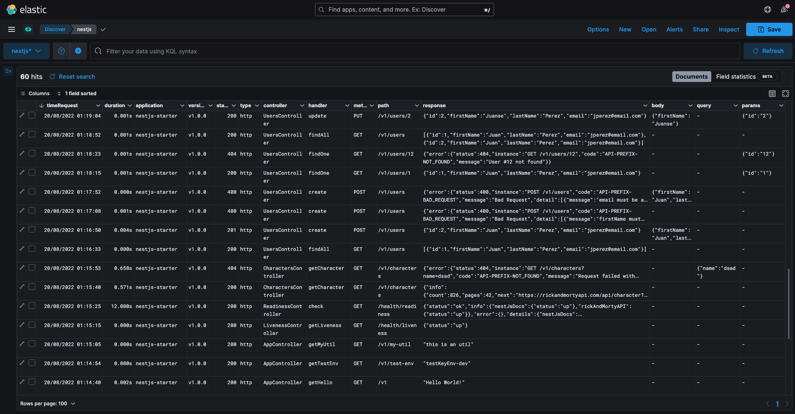
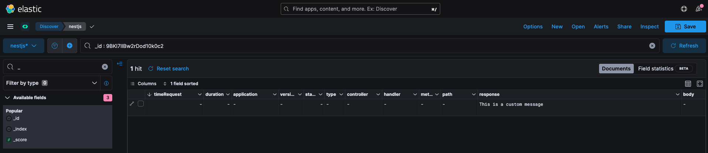

<div align="center">
    
    <h1>Tresdoce NestJS Toolkit<br/>Elk</h1>
</div>

<div align="center">
    
    
    <br/>
    
    
    <br/>
</div>
<br/>

Este módulo está pensado para ser utilizado en [NestJS Starter](https://github.com/rudemex/nestjs-starter), o cualquier
proyecto que utilice una configuración centralizada, siguiendo la misma arquitectura del starter.

## Glosario

- [🥳 Demo](https://nestjs-starter.tresdoce.com.ar/v1/docs)
- [📝 Requerimientos básicos](#basic-requirements)
- [🛠️ Instalar dependencia](#install-dependencies)
- [⚙️ Configuración](#configurations)
- [👨‍💻 Uso](#use)
- [📚 API Reference](#api-reference)
- [📄 Changelog](./CHANGELOG.md)
- [📜 License MIT](./license.md)

---

<a name="basic-requirements"></a>

## 📝 Requerimientos básicos

- [NestJS Starter](https://github.com/rudemex/nestjs-starter)
- Node.js v22.21.1 or higher ([Download](https://nodejs.org/es/download/))
- YARN ≥ 1.22.22 o NPM ≥ 11.6.4
- NestJS v11.1.11 or higher ([Documentación](https://nestjs.com/))

<a name="install-dependencies"></a>

## 🛠️ Instalar dependencia

```
npm install -S @tresdoce-nestjs-toolkit/elk
```

```
yarn add @tresdoce-nestjs-toolkit/elk
```

## 📦 Dependencias internas

Este paquete requiere los siguientes paquetes del toolkit:

| Paquete                                          | Razón                                                     |
| ------------------------------------------------ | --------------------------------------------------------- |
| [`@tresdoce-nestjs-toolkit/utils`](../utils)     | Servicios `FormatService` y `RedactService`               |
| [`@tresdoce-nestjs-toolkit/filters`](../filters) | Función `buildErrorPayload` y tipos de error normalizados |

<a name="configurations"></a>

## ⚙️ Configuración

Agregar los datos de conexión a Elasticsearch en `configuration.ts` utilizando el key `elasticsearch` y que contenga el
objeto con los datos de conexión desde las variables de entorno.

El objeto toma como argumentos los datos de configuración de
[@elastic/elasticsearch](https://www.npmjs.com/package/@elastic/elasticsearch), podés encontrar más información en
la [documentación](https://www.elastic.co/guide/en/elasticsearch/client/javascript-api/current/client-configuration.html).

```typescript
//./src/config/configuration.ts
import { Typings } from '@tresdoce-nestjs-toolkit/core';
import { registerAs } from '@nestjs/config';
import * as PACKAGE_JSON from '../../package.json';

export default registerAs('config', (): Typings.AppConfig => {
  return {
    //...
    elasticsearch: {
      name: `${PACKAGE_JSON.name}`,
      node: process.env.ELASTICSEARCH_NODE, // Default: 'http://localhost:9200'
      indexDate: true,
      redact: {
        paths: process.env.ELK_DOCUMENT_OBFUSCATE
          ? process.env.ELK_DOCUMENT_OBFUSCATE.split(',')
          : [],
        censor: '****',
      },
      /*auth: {
        username: process.env.ELK_NODE_USERNAME,
        password: process.env.ELK_NODE_PASSWORD,
      },*/
    },
    //...
  };
});
```

<details>
<summary>💬 Para ver en detalle todas las propiedades de la configuración, hace clic acá.</summary>

`name`: Es el nombre destinado para el `index` del documento.

- Type: `String`
- Default: `PACKAGE_JSON.name`

`node`: Es el endpoint del servicio para enviar los documentos.

- Type: `String`
- Default: `http://localhost:9200`

`indexDate`: Agrega como sufijo al index del documento la fecha en formato `YYYY.MM.DD`.

- Type: `Boolean`
- Default: `true`
- Example: `index-name-2023.03.23`

`auth`: Es un objeto que requiere los datos de `username` y `password` para conectarse al cliente.

```typescript
{
    //...
    auth: {
        username: 'admin',
        password: 'pass123456',
    }
    //...
}
```

Podés encontrar más información en la
[documentación de ElasticSearch](https://www.elastic.co/guide/en/elasticsearch/client/javascript-api/current/client-configuration.html).

### Ofuscamiento de datos

Para ofuscar los datos sensibles que se van a enviar al servicio, hay que agregar el key `redact`.

> 💬 `redact.obfuscateFrom` es una extensión personalizada implementada en `@tresdoce-nestjs-toolkit/utils` sobre la librería `fast-redact`. No forma parte de la API estándar de `fast-redact`.

`paths`: Es un array de string, en el que se recomienda ser seteado por variables de entorno como strings
separados por coma para que pueda impactar rápidamente en la aplicación sin requerir un re-despliegue.
El path sigue la sintaxis estándar de EcmaScript. [Más info](https://github.com/davidmarkclements/fast-redact#paths--array)

- `a.b.c`
- `a['b'].c`
- `a["b-c"].d`
- `["a-b"].c`
- `a.b.*`
- `a[*].c`
- `*.b`
- `a[0].b`

> 💬 Recomendable revisar el [Document Schema](#elasticsearch-document-schema) para poder armar los paths.

- Type: `String[]`
- Example: `body.email,headers.request["x-b3-spanid"],headers.response["x-b3-spanid"],query.gender,response.results[0].name`

`censor`: Es el valor por el cual va a reemplazar el dato sensible. La longitud del censor determina la cantidad de
caracteres que va a reemplazar al valor a ofuscar (los últimos N caracteres del valor original).

- Type: `String`
- Default: `****`
- Example: `400012345678****`

`obfuscateFrom`: Indica de qué lado del valor se realiza el ofuscamiento. Esta opción se aplica a todos los paths
configurados. Es una extensión de `@tresdoce-nestjs-toolkit/utils`, no parte de `fast-redact` estándar.

- Type: `String`
- Default: `right`
- Values: `left | right`
- Example: `****123456784126 | 400012345678****`

`remove`: Remueve la key con su valor del documento.

- Type: `Boolean`
- Default: `false`

`serialize`: Maneja la salida del ofuscamiento. Si se proporciona una función, se utilizará para serializar el objeto
redactado. Si es `true` devuelve un `JSON.stringify`; de lo contrario devuelve el objeto `JSON`.

- Type: `Boolean | Function`
- Default: `false`

</details>

<a name="use"></a>

## 👨‍💻 Uso

### Modo configuración centralizada

Instanciar el módulo `ElkModule` en el archivo `app.module.ts`, e instanciar en los providers el `ElkInterceptor` para
que pueda interceptar los **requests** y **responses** y enviarlos automáticamente a Elasticsearch.

```typescript
//./src/app.module.ts
import { APP_INTERCEPTOR } from '@nestjs/core';
import { ElkModule, ElkInterceptor } from '@tresdoce-nestjs-toolkit/elk';

@Module({
  imports: [
    //...
    ElkModule,
    //...
  ],
  providers: [
    //...
    {
      provide: APP_INTERCEPTOR,
      useClass: ElkInterceptor,
    },
  ],
  //...
})
export class AppModule {}
```

O bien se puede configurar el `ElkInterceptor` en el archivo `main.ts` sin necesidad de declararlo en el módulo:

```typescript
//./src/main.ts
import { ElkInterceptor, ElkService } from '@tresdoce-nestjs-toolkit/elk';

async function bootstrap() {
  //...
  app.useGlobalInterceptors(new ElkInterceptor(app.get<ElkService>(ElkService)));
  //...
}
```

### Modo registro estático con `ElkModule.register()`

Cuando no se usa la configuración centralizada, es posible registrar el módulo pasando las opciones directamente:

```typescript
import { ElkModule, ElasticsearchOptions } from '@tresdoce-nestjs-toolkit/elk';

@Module({
  imports: [
    ElkModule.register({
      name: 'my-app',
      node: 'http://localhost:9200',
      indexDate: true,
      redact: {
        paths: ['body.password'],
        censor: '****',
      },
    } as ElasticsearchOptions),
  ],
})
export class AppModule {}
```

### Enviar documentos personalizados

Para enviar tus propios datos al **Elasticsearch**, podés inyectar el `ElkService` y llamar a `createIndexDocument()`.

> 💬 El método `createIndexDocument()` maneja los errores de forma silenciosa: en caso de fallo loguea el error con
> `Logger.error()` y continúa sin lanzar excepción, evitando interrumpir el flujo de la aplicación.

```typescript
//./src/app.service.ts
import { ElkService } from '@tresdoce-nestjs-toolkit/elk';

@Injectable()
export class AppService {
  constructor(private readonly elkService: ElkService) {}

  async myCustomMsg(): Promise<void> {
    await this.elkService.createIndexDocument({ response: 'This is a custom message' });
  }
}
```

<a name="elasticsearch-document-schema"></a>

### Elasticsearch Document Schema

El `ElkInterceptor` envía automáticamente un documento con la siguiente estructura por cada request/response:

```js
{
   "@timestamp":  "2023-06-28T21:35:31.882Z",
   "application": "<app-name>",
   "applicationVersion": "<app-version>",
   "appStage": "<app-stage>",
   "path": "<req.path>",
   "url": "<req.url>",
   "controller": "<handler.class.name>",
   "handler": "<handler.name>",
   "type": "http",
   "method": "<req.method>",
   "query": {
     // <req.query>
   },
   "params":{
     // <req.params>
   },
   "body": {
    // <req.body>
   },
   "headers":{
      "request":{
        // <req.headers>
      },
      "response":{
        // <res.headers>
      }
   },
   "cookies":{
      // <req.cookies>
   },
   "requestDuration": 570, // milliseconds
   "statusCode": 200, // <res.statusCode>
   "response":{
      // <response>
   }
}
```

### Visualización en Kibana

Podés descargarte el
[dataview](https://raw.githubusercontent.com/tresdoce/tresdoce-nestjs-toolkit/master/packages/elk/.readme-static/export.ndjson)
de elk para poder visualizar los responses interceptados de manera más ordenada, o armar el tuyo personalizado.

<div align="center">
    
</div>

<div align="center">
    
</div>

<a name="api-reference"></a>

## 📚 API Reference

### `ElkModule`

| Método                                    | Descripción                                                                                      |
| ----------------------------------------- | ------------------------------------------------------------------------------------------------ |
| `ElkModule` (sin método)                  | Modo configuración centralizada. Lee `config.elasticsearch` automáticamente vía `ConfigService`. |
| `register(options: ElasticsearchOptions)` | Registra el módulo con opciones estáticas sin usar la configuración centralizada.                |

### `ElasticsearchOptions`

Extiende `ClientOptions` de `@elastic/elasticsearch` con las siguientes propiedades adicionales:

| Propiedad   | Tipo                     | Descripción                                                                                    |
| ----------- | ------------------------ | ---------------------------------------------------------------------------------------------- |
| `name`      | `string`                 | Nombre del index en Elasticsearch.                                                             |
| `node`      | `string`                 | URL del nodo de Elasticsearch (e.g. `http://localhost:9200`).                                  |
| `indexDate` | `boolean`                | Si es `true`, agrega la fecha (`YYYY.MM.DD`) como sufijo al nombre del index. Default: `true`. |
| `redact`    | `RedactOptions`          | Configuración de ofuscamiento de datos sensibles (ver sección Configuración).                  |
| `auth`      | `{ username, password }` | Credenciales de autenticación básica.                                                          |

El tipo `ElasticsearchOptions` es directamente importable desde este paquete:

```typescript
import { ElasticsearchOptions } from '@tresdoce-nestjs-toolkit/elk';
```

### `ElkService`

| Miembro                                                              | Descripción                                                                                                                                                                   |
| -------------------------------------------------------------------- | ----------------------------------------------------------------------------------------------------------------------------------------------------------------------------- |
| `clientRef`                                                          | Getter que retorna la instancia raw del `Client` de `@elastic/elasticsearch`. Útil para operaciones avanzadas que no cubre el servicio.                                       |
| `createIndexDocument(document: any, suffix?: string): Promise<void>` | Indexa un documento en Elasticsearch. El nombre del index se genera a partir de `name` y opcionalmente `suffix`. Los errores se manejan de forma silenciosa (log + continúa). |
| `serializeResponseInterceptor(...)`                                  | Método interno usado por `ElkInterceptor`.                                                                                                                                    |

```typescript
// Acceder al cliente raw de Elasticsearch:
const rawClient = this.elkService.clientRef;
const info = await rawClient.info();
```

### `ElkInterceptor`

Interceptor que captura cada request/response HTTP y lo indexa en Elasticsearch mediante `ElkService`.
Se registra como `APP_INTERCEPTOR` a nivel global o en `main.ts`.

### Exports de `@elastic/elasticsearch`

Este paquete re-exporta **todo** el contenido de `@elastic/elasticsearch`:

```typescript
import { Client, ClientOptions } from '@tresdoce-nestjs-toolkit/elk';
```

## 📄 Changelog

Todos los cambios notables de este paquete se documentarán en el archivo [Changelog](./CHANGELOG.md).

---

<div align="center">
    <a href="mailto:mdelgado@tresdoce.com.ar" target="_blank" alt="Send an email">
        
    </a><br/>
    <p>Made with ❤</p>
</div>
