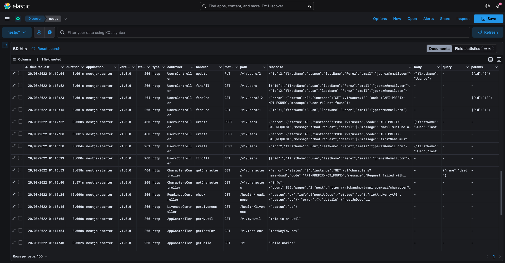

<div align="center">
    
    <h1>Tresdoce NestJS Toolkit<br/>Elk</h1>
</div>

<div align="center">
    
    
    <br/>
    
    
    <br/>
</div>
<br/>

Este módulo está pensado para ser utilizado en [NestJS Starter](https://github.com/rudemex/nestjs-starter), o cualquier
proyecto que utilice una configuración centralizada, siguiendo la misma arquitectura del starter.

## Glosario

- [🥳 Demo](https://nestjs-starter.tresdoce.com.ar/v1/docs)
- [📝 Requerimientos básicos](#basic-requirements)
- [🛠️ Instalar dependencia](#install-dependencies)
- [⚙️ Configuración](#configurations)
- [👨‍💻 Uso](#use)
- [📄 Changelog](./CHANGELOG.md)
- [📜 License MIT](./license.md)

---

<a name="basic-requirements"></a>

## 📝 Requerimientos básicos

- [NestJS Starter](https://github.com/rudemex/nestjs-starter)
- Node.js v20.19.0 or higher ([Download](https://nodejs.org/es/download/))
- YARN v1.22.22 or higher
- NPM v11.2.0 or higher
- NestJS v11.0.13 or higher ([Documentación](https://nestjs.com/))

<a name="install-dependencies"></a>

## 🛠️ Instalar dependencia

```
npm install -S @tresdoce-nestjs-toolkit/elk
```

```
yarn add @tresdoce-nestjs-toolkit/elk
```

<a name="configurations"></a>

## ⚙️ Configuración

Agregar los datos de conexión a Elasticsearch en `configuration.ts` utilizando el key `elasticsearch` y que contenga el
objeto con los datos conexión desde las variables de entorno.

El objeto toma como argumentos los datos de configuración
de [@elastic/elasticsearch](https://www.npmjs.com/package/@elastic/elasticsearch), podés encontrar más información en
la [documentación](https://www.elastic.co/guide/en/elasticsearch/client/javascript-api/current/client-configuration.html)

```typescript
//./src/config/configuration.ts
import { Typings } from '@tresdoce-nestjs-toolkit/core';
import { registerAs } from '@nestjs/config';

export default registerAs('config', (): Typings.AppConfig => {
  return {
    //...
    elasticsearch: {
      indexDate: true,
      name: `${PACKAGE_JSON.name}`,
      node: process.env.ELASTICSEARCH_NODE, // Default: 'http://localhost:9200',
      redact: {
        paths: process.env.ELK_DOCUMENT_OBFUSCATE
          ? process.env.ELK_DOCUMENT_OBFUSCATE.split(',')
          : [],
        censor: '****',
      },
      /*auth: {
        username: process.env.ELK_NODE_USERNAME,
        password: process.env.ELK_NODE_PASSWORD,
      },*/
    },
    //...
  };
});
```

<details>
<summary>💬 Para ver en detalle todas las propiedades de la configuración, hace clic acá.</summary>

`indexDate`: Agrega como sufijo al index del documento la fecha en formato `YYYY.MM.DD`.

- Type: `String`
- Default: `true`
- Example: `index-name-2023.03.23`

`name`: Es el nombre destinado para el `index` del documento.

- Type: `String`
- Default: `PACKAGE_JSON.name`

`node`: Es el endpoint del servicio para enviar los documentos.

- Type: `String`
- Default: `http://localhost:9200`

`auth`: Es un objeto que requiere los datos de `username` y `password` para conectarse al cliente.

```typescript
{
    //...
    auth: {
        username: 'admin',
        password: 'pass123456',
    }
    //...
}
```

Podés encontrar más información en la
[documentación de ElasticSearch](https://www.elastic.co/guide/en/elasticsearch/client/javascript-api/current/client-configuration.html)

### Ofuscamiento de datos

Para ofuscar los datos sensibles que se van a enviar al servicio, hay que agregar el key `redact`.

`paths`: Es un array de string, en el que se recomienda ser seteado por variables de entorno como strings
separados por coma para que pueda impactar rápidamente en la aplicación sin requerir ser re-despliegue.
El path sigue la sintaxis standard de EcmaScript. [Más info](https://github.com/davidmarkclements/fast-redact#paths--array)

- `a.b.c`
- `a['b'].c`
- `a["b-c"].d`
- `["a-b"].c`
- `a.b.*`
- `a[*].c`
- `*.b`
- `a[0].b`

> 💬 Recomendable revisar el [Document Schema](#elasticsearch-document-schema) para poder armar los paths.

- Type: `String[]`
- Example: `body.email,headers.request["x-b3-spanid"],headers.response["x-b3-spanid"],query.gender,response.results[0].name`

`censor`: Es el valor por el cual va a reemplazar el dato sensible, considerar que la longitud del censor es la
cantidad de caracteres que va a reemplazar al valor a ofuscar, es decir, si la longitud del censor es de 4 caracteres,
al valor a ofuscar va a reemplazar los últimos 4 caracteres con el valor seteado.

- Type: `String`
- Default: `****`
- Example: `400012345678****`

`obfuscateFrom`: Indica de qué lado del valor a ofuscar va a realizarse el ofuscamiento, considerar que esta opción se
aplica a todos los datos a ofuscar, y no por path.

- Type: `String`
- Default: `right`
- Values: `left | right`
- Example: `****123456784126 | 400012345678****`

`remove`: Remueve la key con su valor.

- Type: `Boolean`
- Default: `false`

`serialize`: Maneja la salida del ofuscamiento. Si se proporciona una función, se utilizará para serializar el objeto
redactado, en caso de configurarlo en `true` devuelve un `JSON.stringify`, de lo contrario devuelve el `JSON`.

- Type: `Boolean|Function`
- Default: `false`

</details>

Instanciar el módulo `ElkModule` en el archivo `app.module.ts`, e instanciar en los providers el `ElkInterceptor` para
que pueda interceptar los **requests** y **responses** y los
envíe automáticamente al elasticsearch.

```typescript
//./src/app.module.ts
//...
import { APP_INTERCEPTOR } from '@nestjs/core';
import { ElkModule, ElkInterceptor } from '@tresdoce-nestjs-toolkit/elk';

@Module({
  imports: [
    //...
    ElkModule,
    //...
  ],
  providers: [
    //...
    {
      provide: APP_INTERCEPTOR,
      useClass: ElkInterceptor,
    },
  ],
  //...
})
export class AppModule {}
```

O bien se puede configurar el `ElkInterceptor` en el archivo `main.ts` de la siguiente manera y no es necesario
implementarlo en el módulo.

```typescript
//./src/main.ts
//...
import { ElkInterceptor, ElkService } from '@tresdoce-nestjs-toolkit/elk';

async function bootstrap() {
  //...
  app.useGlobalInterceptors(new ElkInterceptor(app.get<ElkService>(ElkService)));
  //...
}
```

<a name="elasticsearch-document-schema"></a>

### Elasticsearch Document Schema

```js
{
   "@timestamp":  "2023-06-28T21:35:31.882Z",
   "application": "<app-name>",
   "applicationVersion": "<app-version>",
   "appStage": "<app-stage>",
   "path": "<req.path>",
   "url": "<req.url>",
   "controller": "<handler.class.name>",
   "handler": "<handler.name>",
   "type": "http",
   "method": "<req.method>",
   "query": {
     // <req.query>
   },
   "params":{
     // <req.params>
   },
   "body": {
    // <req.body>
   },
   "headers":{
      "request":{
        // <req.headers>
      },
      "response":{
        // <res.headers>
      }
   },
   "cookies":{
      // <req.cookies>
   },
   "requestDuration": 570, // milliseconds
   "statusCode": 200, // <res.statusCode>
   "response":{
      // <response>
   }
}
```

<a name="use"></a>

## 👨‍💻 Uso

Podés descargarte
el [dataview](https://raw.githubusercontent.com/tresdoce/tresdoce-nestjs-toolkit/master/packages/elk/.readme-static/export.ndjson)
de elk para poder visualizar los responses interceptados de manera más ordenada, o armar el tuyo personalizado.

<div align="center">
    
</div>

Para enviar tus propios datos al **Elasticsearch**, podés inyectar el `ElkService` llamando a la
función `createIndexDocument()`, la cual recibe un objeto como parámetro.

```typescript
//./src/app.service.ts
//...
import { ElkService } from '@tresdoce-nestjs-toolkit/elk';

@Injectable()
export class AppService {
  constructor(private readonly elkService: ElkService) {}

  async myCustomMsg(): Promise<void> {
    await this.elkService.createIndexDocument({ response: 'This is a custom message' });
  }

  //...
}
```

<div align="center">
    
</div>

## 📄 Changelog

Todos los cambios notables de este paquete se documentarán en el archivo [Changelog](./CHANGELOG.md).

---

<div align="center">
    <a href="mailto:mdelgado@tresdoce.com.ar" target="_blank" alt="Send an email">
        
    </a><br/>
    <p>Made with ❤</p>
</div>
