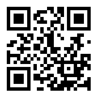
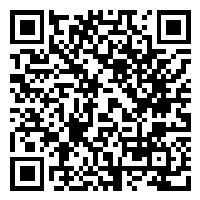
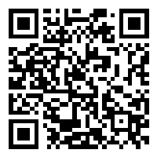
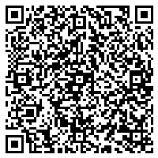
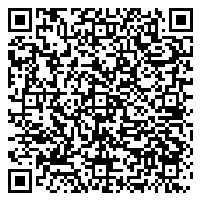
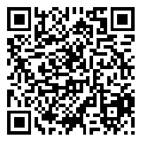
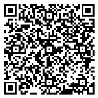
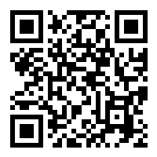
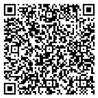
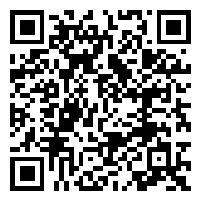

<div align="center">
    
    <h1>Tresdoce NestJS Toolkit<br/>QrCode</h1>
</div>

<div align="center">
    
    
    <br/>
    
    
    <br/>
</div>
<br/>

Este módulo está pensado para ser utilizado en [NestJS Starter](https://github.com/rudemex/nestjs-starter), o cualquier
proyecto que utilice una configuración centralizada, siguiendo la misma arquitectura del starter.

## Glosario

- [🥳 Demo](https://nestjs-starter.tresdoce.com.ar/v1/docs)
- [📝 Requerimientos básicos](#basic-requirements)
- [🛠️ Instalar dependencia](#install-dependencies)
- [👨‍💻 Uso](#use)
- [📄 Changelog](./CHANGELOG.md)
- [📜 License MIT](./license.md)

---

<a name="basic-requirements"></a>

## 📝 Requerimientos básicos

- [NestJS Starter](https://github.com/rudemex/nestjs-starter)
- Node.js v18.20.3 or higher ([Download](https://nodejs.org/es/download/))
- YARN v1.22.19 or higher
- NPM v10.7.0 or higher
- NestJS v10.3.8 or higher ([Documentación](https://nestjs.com/))

<a name="install-dependencies"></a>

## 🛠️ Instalar dependencia

```
npm install -S @tresdoce-nestjs-toolkit/qrcode
```

```
yarn add @tresdoce-nestjs-toolkit/qrcode
```

<a name="use"></a>

## 👨‍💻 Uso

El servicio `QrCodeService` tiene disponible la función `createQrCode()` que genera el código QR y lo retorna como URL
en **base64**, y también cuenta con la función `createQrCodeBuffer()` la cual genera el código QR y lo retorna como imagen.

Para poder hacer uso de estas funcionalidades, es cuestión de importar el `QrCodeModule` en el módulo o bien inyectar el
servicio `QrCodeService` en el provider del módulo, recomendable que sea en el módulo principal.

#### Importación de módulo

```typescript
// ./src/app.module.ts
import { Module } from '@nestjs/common';
import { QrCodeModule } from '@tresdoce-nestjs-toolkit/qrcode';

@Module({
  //...
  imports: [
    //...
    QrCodeModule,
    //...
  ],
  //...
})
export class AppModule {}
```

#### Inyección de servicio

```typescript
// ./src/app.module.ts
import { Module } from '@nestjs/common';
import { QrCodeService } from '@tresdoce-nestjs-toolkit/qrcode';

@Module({
  //...
  providers: [
    //...
    QrCodeService,
    //...
  ],
  //...
})
export class AppModule {}
```

### Controllers

Dependiendo que tipo de código QR deseas retornar, la diferencia va a estar en el controlador de la aplicación.

```typescript
// ./src/app.controller.ts
import { Controller, Get, Res } from '@nestjs/common';
import type { Response } from 'express';

import { AppService } from './app.service';

@Controller()
export class AppController {
  constructor(private readonly appService: AppService) {}

  // Retorna URL en base64 del código QR
  @Get('qr-code-url')
  async createQrCodeUrl() {
    return await this.appService.createQrCodeUrl();
  }

  // Retorna imagen del código QR
  @Get('qr-code-buffer')
  async createQrCodeBuffer(@Res() response: Response) {
    const qrCodeBuffer = await this.appService.createQrCodeBuffer();
    response.status(200);
    response.type('image/png');
    response.send(qrCodeBuffer);
  }
}
```

### Services

Inyectamos el `QrCodeService` en el constructor de nuestro service para poder hacer uso de las funcionalidades.

La función para crear códigos QR admite dos parámetros, `data` que es un objeto que contiene el tipo de contenido y sus
valores y `options` que es un objeto para customizar el código QR ya sea tamaño, version, margin, color, etc., este
servicio ya cuenta con una configuración base, la cual se puede reemplazar los valores enviando los nuevos atributos.

Para más información sobre las opciones disponibles pódes visitar la documentación de [QRCode - Options](https://www.npmjs.com/package/qrcode#qr-code-options)

```typescript
// ./src/app.service.ts
import { Inject, Injectable } from '@nestjs/common';
import { QrCodeService } from '@tresdoce-nestjs-toolkit/qrcode';

@Injectable()
export class AppService {
  constructor(@Inject(QrCodeService) private qrcode: QrCodeService) {}

  // Genera código QR como URL en base64
  async createQrCodeUrl(): Promise<string> {
    const options = {
      width: 300,
    };
    return await this.qrcode.createQrCode({ type: 'text', text: 'Hola Mundo' }, options);
  }

  // Genera código QR como Buffer
  async createQrCodeBuffer(): Promise<Buffer> {
    const options = {
      width: 300,
    };
    return await this.qrcode.createQrCodeBuffer({ type: 'text', text: 'Hola Mundo' }, options);
  }
}
```

### Tipos de código QR

El módulo cuenta con la generación de diversos contenidos en el código QR que va a depender de la estructura y contenido
de la data que le envies a la función, sea URL o Buffer.

##### Texto plano

```typescript
createQrCode({ type: 'text', text: 'Hola Mundo' });
```

<div align="center">
    
</div>

##### URL

```typescript
createQrCode({ type: 'url', url: 'https://www.ejemplo.com' });
```

<div align="center">
    
</div>

##### WIFI

```typescript
createQrCode({
  type: 'wifi',
  ssid: 'MiWifi',
  password: 'password123',
  encryption: 'WPA',
});
```

<div align="center">
    
</div>

##### vCard

```typescript
createQrCode({
  type: 'vcard',
  name: 'Juan Perez',
  phone: '+34123456789',
  email: 'juan.perez@ejemplo.com',
  organization: 'Ejemplo S.A.',
});
```

<div align="center">
    
</div>

##### Email

```typescript
createQrCode({
  type: 'email',
  address: 'info@ejemplo.com',
  subject: 'Saludos',
  body: 'Hola, este es un email de ejemplo.',
});
```

<div align="center">
    
</div>

##### SMS

```typescript
createQrCode({
  type: 'sms',
  phone: '+34123456789',
  message: 'Hola, ¿cómo estás?',
});
```

<div align="center">
    
</div>

##### Whatsapp

```typescript
createQrCode({
  type: 'whatsapp',
  phone: '+34123456789',
  message: 'Hola, ¿cómo estás?',
});
```

<div align="center">
    
</div>

##### Geolocalización

```typescript
createQrCode({
  type: 'geo',
  latitude: -34.6395141,
  longitude: -58.4022226,
});
```

<div align="center">
    
</div>

##### Evento

```typescript
createQrCode({
  type: 'event',
  summary: 'Reunión de Trabajo',
  start: '20261015T170000Z',
  end: '20261015T190000Z',
});
```

<div align="center">
    
</div>

##### Criptomoneda

```typescript
createQrCode({
  type: 'crypto',
  currency: 'bitcoin',
  address: '1BoatSLRHtKNngkdXEeobR76b53LETtpyT',
});
```

<div align="center">
    
</div>

## 📄 Changelog

Todos los cambios notables de este paquete se documentarán en el archivo [Changelog](./CHANGELOG.md).

---

<div align="center">
    <a href="mailto:mdelgado@tresdoce.com.ar" target="_blank" alt="Send an email">
        
    </a><br/>
    <p>Made with ❤</p>
</div>
