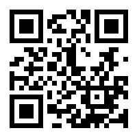
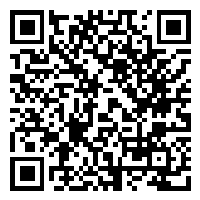
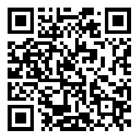
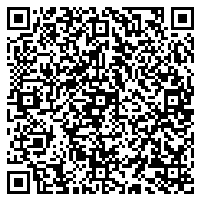
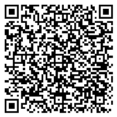
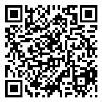
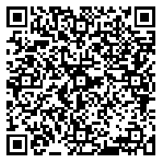
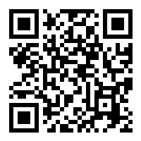
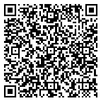
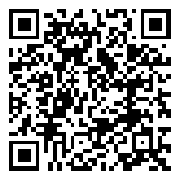

<div align="center">
    
    <h1>Tresdoce NestJS Toolkit<br/>QrCode</h1>
</div>

<div align="center">
    
    
    <br/>
    
    
    <br/>
</div>
<br/>

Este módulo está pensado para ser utilizado en [NestJS Starter](https://github.com/rudemex/nestjs-starter), o cualquier
proyecto que utilice una configuración centralizada, siguiendo la misma arquitectura del starter.

## Glosario

- [🥳 Demo](https://nestjs-starter.tresdoce.com.ar/v1/docs)
- [📝 Requerimientos básicos](#basic-requirements)
- [🛠️ Instalar dependencia](#install-dependencies)
- [👨‍💻 Uso](#use)
- [📖 API Reference](#api-reference)
- [📄 Changelog](./CHANGELOG.md)
- [📜 License MIT](./license.md)

---

<a name="basic-requirements"></a>

## 📝 Requerimientos básicos

- [NestJS Starter](https://github.com/rudemex/nestjs-starter)
- Node.js v22.21.1 or higher ([Download](https://nodejs.org/es/download/))
- YARN ≥ 1.22.22 o NPM ≥ 11.6.4
- NestJS v11.1.11 or higher ([Documentación](https://nestjs.com/))

<a name="install-dependencies"></a>

## 🛠️ Instalar dependencia

```
npm install -S @tresdoce-nestjs-toolkit/qrcode
```

```
yarn add @tresdoce-nestjs-toolkit/qrcode
```

## 📦 Dependencias internas

Este paquete no tiene dependencias internas del toolkit. Puede utilizarse de forma independiente.

<a name="use"></a>

## 👨‍💻 Uso

El servicio `QrCodeService` expone dos métodos:

- `createQrCode()` — genera el código QR y lo retorna como URL en **base64** (data URL `image/jpeg`).
- `createQrCodeBuffer()` — genera el código QR y lo retorna como **Buffer** PNG.

### Importación del módulo

`QrCodeModule` es `@Global()`, por lo que basta con importarlo una sola vez en el módulo raíz.

```typescript
// ./src/app.module.ts
import { Module } from '@nestjs/common';
import { QrCodeModule } from '@tresdoce-nestjs-toolkit/qrcode';

@Module({
  imports: [
    QrCodeModule,
    //...
  ],
})
export class AppModule {}
```

Alternativamente, se puede registrar el servicio directamente en el providers de cualquier módulo:

```typescript
import { QrCodeService } from '@tresdoce-nestjs-toolkit/qrcode';

@Module({
  providers: [QrCodeService],
  exports: [QrCodeService],
})
export class MyModule {}
```

### Controllers

El tipo de respuesta determina cómo se configura el controlador:

```typescript
// ./src/app.controller.ts
import { Controller, Get, Res } from '@nestjs/common';
import type { Response } from 'express';
import { AppService } from './app.service';

@Controller()
export class AppController {
  constructor(private readonly appService: AppService) {}

  // Retorna URL en base64 del código QR
  @Get('qr-code-url')
  async createQrCodeUrl() {
    return await this.appService.createQrCodeUrl();
  }

  // Retorna imagen PNG del código QR
  @Get('qr-code-buffer')
  async createQrCodeBuffer(@Res() response: Response) {
    const qrCodeBuffer = await this.appService.createQrCodeBuffer();
    response.status(200);
    response.type('image/png');
    response.send(qrCodeBuffer);
  }
}
```

### Services

```typescript
// ./src/app.service.ts
import { Inject, Injectable } from '@nestjs/common';
import { QrCodeService } from '@tresdoce-nestjs-toolkit/qrcode';

@Injectable()
export class AppService {
  constructor(@Inject(QrCodeService) private qrcode: QrCodeService) {}

  // Genera código QR como URL en base64 (jpeg, 300px)
  async createQrCodeUrl(): Promise<string> {
    return await this.qrcode.createQrCode({ type: 'text', text: 'Hola Mundo' }, { width: 300 });
  }

  // Genera código QR como Buffer PNG (300px)
  async createQrCodeBuffer(): Promise<Buffer> {
    return await this.qrcode.createQrCodeBuffer(
      { type: 'text', text: 'Hola Mundo' },
      { width: 300 },
    );
  }
}
```

### Tipos de código QR

El parámetro `data` es un objeto tipado que determina el contenido del QR. A continuación se muestran
todos los tipos disponibles.

##### Texto plano

```typescript
createQrCode({ type: 'text', text: 'Hola Mundo' });
```

<div align="center">
    
</div>

##### URL

La URL es validada antes de generar el QR. Si no es una URL válida, se lanza un error.

```typescript
createQrCode({ type: 'url', url: 'https://www.ejemplo.com' });
```

<div align="center">
    
</div>

##### WIFI

```typescript
createQrCode({
  type: 'wifi',
  ssid: 'MiWifi',
  password: 'password123',
  encryption: 'WPA', // 'WEP' | 'WPA' | 'WPA2'
});
```

<div align="center">
    
</div>

##### vCard

```typescript
createQrCode({
  type: 'vcard',
  name: 'Juan Perez',
  phone: '+34123456789',
  email: 'juan.perez@ejemplo.com',
  organization: 'Ejemplo S.A.',
});
```

<div align="center">
    
</div>

##### Email

```typescript
createQrCode({
  type: 'email',
  address: 'info@ejemplo.com',
  subject: 'Saludos',
  body: 'Hola, este es un email de ejemplo.',
});
```

<div align="center">
    
</div>

##### SMS

```typescript
createQrCode({
  type: 'sms',
  phone: '+34123456789',
  message: 'Hola, ¿cómo estás?',
});
```

<div align="center">
    
</div>

##### Whatsapp

```typescript
createQrCode({
  type: 'whatsapp',
  phone: '+34123456789',
  message: 'Hola, ¿cómo estás?',
});
```

<div align="center">
    
</div>

##### Geolocalización

```typescript
createQrCode({
  type: 'geo',
  latitude: -34.6395141,
  longitude: -58.4022226,
});
```

<div align="center">
    
</div>

##### Evento de calendario

Las fechas deben estar en formato iCal UTC (`YYYYMMDDTHHmmssZ`).

```typescript
createQrCode({
  type: 'event',
  summary: 'Reunión de Trabajo',
  start: '20261015T170000Z',
  end: '20261015T190000Z',
});
```

<div align="center">
    
</div>

##### Criptomoneda

```typescript
createQrCode({
  type: 'crypto',
  currency: 'bitcoin',
  address: '1BoatSLRHtKNngkdXEeobR76b53LETtpyT',
});
```

<div align="center">
    
</div>

<a name="api-reference"></a>

## 📖 API Reference

### `QrCodeModule`

Módulo global (`@Global()`). Provee y exporta `QrCodeService`.

### `QrCodeService`

| Método               | Firma                                                                     | Descripción                              |
| -------------------- | ------------------------------------------------------------------------- | ---------------------------------------- |
| `createQrCode`       | `(data: QRCodeData, options?: QRCodeToDataURLOptions) => Promise<string>` | Genera un QR como data URL base64 (jpeg) |
| `createQrCodeBuffer` | `(data: QRCodeData, options?: QRCodeToBufferOptions) => Promise<Buffer>`  | Genera un QR como Buffer PNG             |

### Opciones por defecto

Las siguientes son las opciones base aplicadas a cada método. Se pueden sobreescribir pasando el parámetro `options`.

**`createQrCode` (URL/base64):**

| Opción                 | Valor por defecto |
| ---------------------- | ----------------- |
| `type`                 | `'image/jpeg'`    |
| `errorCorrectionLevel` | `'H'`             |
| `width`                | `200`             |
| `margin`               | `2`               |
| `rendererOpts.quality` | `0.92`            |

**`createQrCodeBuffer` (Buffer):**

| Opción                 | Valor por defecto |
| ---------------------- | ----------------- |
| `type`                 | `'png'`           |
| `errorCorrectionLevel` | `'H'`             |
| `width`                | `200`             |
| `margin`               | `2`               |

Para más información sobre las opciones disponibles, visitar la documentación de [QRCode - Options](https://www.npmjs.com/package/qrcode#qr-code-options).

### Interfaces de tipos QR

| Interfaz      | Campo `type` | Campos                                                                     |
| ------------- | ------------ | -------------------------------------------------------------------------- |
| `PlainTextQR` | `'text'`     | `text: string`                                                             |
| `URLQR`       | `'url'`      | `url: string`                                                              |
| `WiFiQR`      | `'wifi'`     | `ssid: string`, `password: string`, `encryption: 'WEP' \| 'WPA' \| 'WPA2'` |
| `VCardQR`     | `'vcard'`    | `name: string`, `organization: string`, `phone: string`, `email: string`   |
| `EmailQR`     | `'email'`    | `address: string`, `subject: string`, `body: string`                       |
| `SMSQR`       | `'sms'`      | `phone: string`, `message: string`                                         |
| `WhatsappQR`  | `'whatsapp'` | `phone: string`, `message: string`                                         |
| `GeoQR`       | `'geo'`      | `latitude: number`, `longitude: number`                                    |
| `EventQR`     | `'event'`    | `summary: string`, `start: string`, `end: string`                          |
| `CryptoQR`    | `'crypto'`   | `currency: string`, `address: string`                                      |

El tipo unión `QRCodeData` acepta cualquiera de las interfaces anteriores.

### Constantes exportadas

| Constante                        | Valor                         | Descripción                                   |
| -------------------------------- | ----------------------------- | --------------------------------------------- |
| `QRCODE_MSG_URL_NOT_VALID`       | `'URL not valid'`             | Error cuando la URL no es válida              |
| `QRCODE_MSG_INVALID_DATA_TYPE`   | `'Invalid QR Code data type'` | Error cuando el tipo de dato no es reconocido |
| `QRCODE_MSG_ERROR_CREATE_QRCODE` | `'Error creating QR code:'`   | Prefijo de error genérico al crear el QR      |
| `DEFAULT_QRCODE_OPTIONS_URL`     | ver tabla arriba              | Opciones por defecto para data URL            |
| `DEFAULT_QRCODE_OPTIONS_BUFFER`  | ver tabla arriba              | Opciones por defecto para Buffer              |

### Re-exportaciones

Este paquete re-exporta completamente la librería `qrcode` (`export * from 'qrcode'`), por lo que todos sus
tipos e interfaces (`QRCodeToDataURLOptions`, `QRCodeToBufferOptions`, etc.) pueden importarse directamente
desde `@tresdoce-nestjs-toolkit/qrcode`.

## 📄 Changelog

Todos los cambios notables de este paquete se documentarán en el archivo [Changelog](./CHANGELOG.md).

---

<div align="center">
    <a href="mailto:mdelgado@tresdoce.com.ar" target="_blank" alt="Send an email">
        
    </a><br/>
    <p>Made with ❤</p>
</div>
